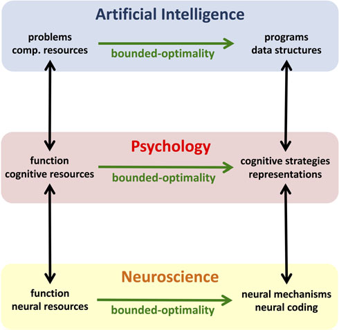

# Abstract

Modeling human cognition is challenging because there are infinitely many mechanisms that can generate any given observation. Some researchers address this by constraining the hypothesis space through assumptions about what the human mind can and cannot do, while others constrain it through principles of rationality and adaptation. Recent work in economics, psychology, neuroscience, and linguistics has begun to integrate both approaches by augmenting rational models with cognitive constraints, incorporating rational principles into cognitive architectures, and applying optimality principles to understanding neural representations. We identify the rational use of limited resources as a unifying principle underlying these diverse approaches, expressing it in a new cognitive modeling paradigm called *resource-rational analysis*. The integration of rational principles with realistic cognitive constraints makes resource-rational analysis a promising framework for reverse-engineering cognitive mechanisms and representations. It has already shed new light on the debate about human rationality and can be leveraged to revisit classic questions of cognitive psychology within a principled computational framework. We demonstrate that resource-rational models can reconcile the mind’s most impressive cognitive skills with people’s ostensive irrationality. Resource-rational analysis also provides a new way to connect psychological theory more deeply with artificial intelligence, economics, neuroscience, and linguistics.

## 1. Introduction

Cognitive modeling plays an increasingly important role in our endeavor to understand the human mind. Building models of people’s cognitive strategies and representations is useful for at least three reasons. First, testing our understanding of psychological phenomena by recreating them in computer simulations forces precision and helps to identify gaps in explanations. Second, computational modeling permits the transfer of insights about human intelligence to the creation of artificial intelligence (AI) and vice versa. Third, cognitive modeling of empirical phenomena is a way to infer the underlying psychological mechanisms, which is critical to predicting human behavior in novel situations.

Unfortunately, inferring cognitive mechanisms and representations from limited experimental data is an ill-posed problem, because any behavior could be generated by infinitely many candidate mechanisms (Anderson 1978). Thus, cognitive scientists must have strong inductive biases to infer cognitive mechanisms from limited data. Theoretical frameworks, such as evolutionary psychology (Buss 1995), embodied cognition (Wilson 2002), production systems (e.g., Anderson 1996), dynamical systems theory (Beer 2000), connectionism (Rumelhart & McClelland 1987), Bayesian models of cognition (Griffiths et al. 2010), ecological rationality (Todd & Gigerenzer 2012), and the free-energy principle (Friston 2010) to name just a few, provide researchers guidance in the search for plausible hypotheses. Here, we focus on a particular subset of theoretical frameworks that emphasize developing computational models of cognition: cognitive architectures (Langley et al. 2009), connectionism (Rumelhart & McClelland 1987), computational neuroscience (Dayan & Abbott 2001), and rational analysis (Anderson 1990). These frameworks provide complementary functional or architectural constraints on modeling human cognition. Cognitive architectures, such as ACT-R (Anderson et al. 2004), connectionism, and computational neuroscience constrain the modeler’s hypothesis space based on previous findings about the nature, capacities, and limits of the mind’s cognitive architecture. These frameworks scaffold explanations of psychological phenomena with assumptions about what the mind can and cannot do. But the space of cognitively feasible mechanisms is so vast that most phenomena can be explained in many different ways – even within the confines of a cognitive architecture.

As psychologists, we are trying to understand a system far more intelligent than anything we have ever created ourselves; it is possible that the ingenious design and sophistication of the mind’s cognitive mechanisms are beyond our creative imagination. To address this challenge, rational models of cognition draw inspiration from the best examples of intelligent systems in computer science and statistics. Perhaps the most influential framework for developing rational models of cognition is rational analysis (Anderson 1990). In contrast to traditional cognitive psychology, rational analysis capitalizes on the *functional* constraints imposed by goals and the structures of the environment rather than the structural constraints imposed by cognitive architectures. Its inductive bias toward rational explanations is often rooted in the assumption that evolution and learning have optimally adapted the human mind to the structure of its environment (Anderson 1990). This assumption is supported by empirical findings that under naturalistic conditions people achieve near-optimal performance in perception (Knill & Pouget 2004; Knill & Richards 1996; Körding & Wolpert 2004), statistical learning (Fiser et al. 2010), and motor control (Todorov 2004; Wolpert & Ghahramani 2000), as well as inductive learning and reasoning (Griffiths & Tenenbaum 2006; 2009). Valid rational modeling provides solid theoretical justifications and enables researchers to translate assumptions about people’s goals and the structure of the environment into substantive, detailed, and often surprisingly accurate predictions about human behavior under a wide range of circumstances.

That said, the inductive bias of rational theories can be insufficient to identify the correct explanation and sometimes points modelers in the wrong direction. Canonical rational theories of human behavior have several fundamental problems. First, human judgment and decision-making systematically violate the axioms of rational modeling frameworks such as expected utility theory (Kahneman & Tversky 1979), logic (Wason 1968), and probability theory (Tversky & Kahneman 1973; 1974). Furthermore, standard rational models define optimal behavior without specifying the underlying cognitive and neural mechanisms that psychologists and neuroscientists seek to understand. Rational models of cognition are expressed at what Marr (1982) termed the “computational level,” identifying the abstract computational problems that human minds must solve and their ideal solutions. In contrast, psychological theories have traditionally been expressed at Marr’s “algorithmic level,” focusing on representations and the algorithms by which they are transformed.

> FALK LIEDER leads the Max Planck Research Group for Rationality Enhancement at the MPI for Intelligent Systems in Tübingen. His current research builds on the theory of resource-rationality to develop a scientific foundation and practical tools for improving the human mind by promoting and supporting cognitive growth, goal setting, and goal achievement.
>
> THOMAS L. GRIFFITHS is the Henry R. Luce Professor of Information Technology, Consciousness, and Culture at Princeton University. His research explores connections between psychology and computer science, using ideas from machine learning and artificial intelligence to understand how people solve the challenging computational problems they encounter in everyday life.

This suggests that relying either cognitive architectures or rationality alone might be insufficient to uncover the cognitive mechanisms that give rise to human intelligence. The strengths and weaknesses of these two approaches are complementary – each offers exactly what the other is missing. The inductive constraints of modeling human cognition in terms of cognitive architectures were, at least to some extent, built from the ground up by studying and measuring the mind’s elementary operations. In contrast, the inductive constraints of rational modeling are derived from top-down considerations of the requirements of intelligent action. We believe that the architectural constraints of bottom-up approaches to cognitive modeling should be integrated with the functional constraints of rational analysis.

The integration of (bottom-up) cognitive constraints and (top-down) rational principles is an approach that is starting to be used across several disciplines, and initial results suggest that combining the strengths of these approaches results in more powerful models that can account for a wider range of cognitive phenomena. Economists have developed mathematical models of bounded-rational decision-making to accommodate people’s violations of classic notions of rationality (e.g., Dickhaut et al. 2009; Gabaix et al. 2006; Simon 1956; C. A. Sims 2003). Neuroscientists are learning how the brain represents the world as a trade-off between accuracy and metabolic cost (e.g., Levy & Baxter 2002; Niven & Laughlin 2008; Sterling & Laughlin 2015). Linguists are explaining language as a system for efficient communication (e.g., Hawkins 2004; Kemp & Regier 2012; Regier et al. 2007; Zaslavsky et al. 2018; Zipf 1949), and more recently, psychologists have also begun to incorporate cognitive constraints into rational models (e.g., Griffiths et al. 2015).

In this article, we identify the rational use of limited resources as a common theme connecting these developments and providing a unifying framework for explaining the corresponding phenomena. We review recent multidisciplinary progress in integrating rational models with cognitive constraints and outline future directions and opportunities. We start by reviewing the historical role of classic notions of rationality in explaining human behavior and some cognitive biases that have challenged this role. We present our integrative modeling paradigm, *resource rationality*, as a solution to the problems faced by previous approaches, illustrating how its central idea can reconcile rational principles with numerous cognitive biases. We then outline how future work might leverage *resource-rational analysis* to answer classic questions of cognitive psychology, revisit the debate about human rationality, and build bridges from cognitive modeling to computational neuroscience and AI.

## 2. A brief history of rationality

Notions of rationality have a long history and have been influential across multiple scientific disciplines, including philosophy (Harman 2013; Mill 1882), economics (Friedman & Savage 1948; 1952), psychology (Braine 1978; Chater et al. 2006; Griffiths et al. 2010; Newell et al. 1958; Oaksford & Chater 2007), neuroscience (Knill & Pouget 2004), sociology (Hedström & Stern 2008), linguistics (Frank & Goodman 2012), and political science (Lohmann 2008). Most rational models of the human mind are premised on the classic notion of rationality (Sosis & Bishop 2014), according to which people act to maximize their expected utility, reason based on the laws of logic, and handle uncertainty according to probability theory. For instance, rational actor models (Friedman & Savage 1948; 1952) predict that decision-makers select the action $a^{\star}$ that maximizes their expected utility (Von Neumann & Morgenstern 1944), that is

$$a^{\star} = \text{arg max}_a \int u(o) \cdot p(o|a) \, do, \quad (1)$$

where the utility function $u$ measures how good the outcome $o$ is from the decision-maker’s perspective and $p(o|a)$ is the conditional probability of its occurrence if action $a$ is taken.

Psychologists soon began to interpret the classic notions of rationality as hypotheses about human thinking and decision-making (e.g., Edwards 1954; Newell et al. 1958) and other disciplines also adopted rational principles to predict human behavior. The foundation of these models was shaken when a series of experiments suggested that people’s judgment and decision-making systematically violate the laws of logic (Wason 1968) probability theory (Tversky & Kahneman 1974), and expected utility theory (Kahneman & Tversky 1979). These systematic deviations are known as *cognitive biases*. The well-known anchoring bias (Tversky & Kahneman 1974), base-rate neglect and the conjunction fallacy (Kahneman & Tversky 1972), people’s tendency to systematically overestimate the frequency of extreme events (Lichtenstein et al. 1978), and overconfidence (Moore & Healy 2008) are just a few examples of the dozens of biases that have been reported over the last four decades (Gilovich et al. 2002). In many cases the interpretation of these empirical phenomena as irrational errors has been challenged by subsequent analyses (e.g., Dawes & Mulford 1996; Fawcett et al. 2014; Gigerenzer 2015; Gigerenzer et al. 2012; Hahn & Warren 2009; Hertwig et al. 2005). But as reviewed below, cognitive limitations also appear to play a role in at least some of the reported biases. While some of these biases can be described by models such as prospect theory (Kahneman & Tversky 1979; Tversky & Kahneman 1992) such descriptions do not reveal the underlying causes and mechanisms. According to Tversky and Kahneman (1974), cognitive biases result from people’s use of fast but fallible cognitive strategies known as *heuristics*. Unfortunately, the number of heuristics that have been proposed is so high that it is often difficult to predict which heuristic people will use in a novel situation and what the results will be.

The undoing of expected utility theory, logic, and probability theory as principles of human reasoning and decision-making has not only challenged the idealized concept of “man as rational animal” but also taken away mathematically precise, overarching theoretical principles for modeling human behavior and cognition. These principles have been replaced by different concepts of “bounded rationality” according to which cognitive constraints limit people’s performance so that classical notions of rationality become unattainable (Simon 1955; Tversky & Kahneman 1974). While research in the tradition of Simon (1955) has developed notions of rationality that take people’s limited cognitive resources into account (e.g., Gigerenzer & Selten 2002), research in the tradition of Tversky and Kahneman (1974) has sought to characterize bounded rationality in terms of cognitive biases. In the latter line of work and its applications, the explanatory principle of bounded rationality has often been used rather loosely, that is without precisely specifying the underlying cognitive limitations and exactly how they constrain cognitive performance (Gilovich et al. 2002). As illustrated in Figure 1, infinitely many cognitive mechanisms are consistent with this rather vague use of the term “bounded rationality.” This raises questions about ![Figure 1. Resource rationality and its relationship to optimality and Tversky and Kahneman’s concept of bounded rationality. The horizontal dimension corresponds to alternative cognitive mechanisms that achieve the same level of performance. Each dot represents a possible mind. The gray dots are minds with bounded cognitive resources and the blue dots are minds with unlimited computational resources. The thick black line symbolizes the bounds entailed by people’s limited cognitive resources. Resource limitations reflect anatomical, physiological, and metabolic constraints on neural information processing as discussed below as time constraints, but they can be modelled at a higher level of abstraction (e.g., in terms of processing speed or multi-tasking capacity). For the purpose of deriving a resource-rational mechanism these constraints are assumed to be fixed. (Some cognitive constraints may change as a consequence of brain development, exhaustion, and many other factors. Sufficiently large changes may warrant the resource-rational analysis to be redone.)](image_page3_1.jpeg) which of those mechanisms people use, which of them they should use, and how these two sets of mechanisms are related to each other. Answering these questions requires a more precise theory of bounded rationality.

Simon (1955; 1956) famously argued that rational decision strategies must be adapted to both the structure of the environment and the mind’s cognitive limitations. He suggested that the pressure for adaptation makes it rational to use a heuristic that selects the first option that is good enough instead of trying to find the ideal option: *satisficing*. Simon’s ideas inspired the theory of *ecological rationality*, which maintains that people make adaptive use of simple heuristics that exploit the structure of natural environments (Gigerenzer & Goldstein 1996; Gigerenzer & Selten 2002; Hertwig & Hoffrage 2013; Todd & Brighton 2016; Todd & Gigerenzer 2012). A number of candidate heuristics have been identified over the years (Gigerenzer & Gaissmaier 2011; Gigerenzer & Goldstein 1996; Gigerenzer et al. 1999; Hertwig & Hoffrage 2013; Todd & Gigerenzer 2012) that typically use only a small subset of available information and perform much less computation than would be required to compute expected utilities (Gigerenzer & Gaissmaier 2011; Gigerenzer & Goldstein 1996).

In parallel work, Anderson (1990) developed the idea of understanding human cognition as a rational adaptation to environmental structure and goals pursued within it, creating a cognitive modeling paradigm known as *rational analysis* (Chater & Oaksford 1999) that derives models of human behavior from structural environmental assumptions according to the six steps summarized in Box 1 and Figure 2. Rational process models can be used to connect the computational level of analysis to the algorithmic level of analysis. The principle of resource rationality allows us to derive rational process models from assumptions about a system’s function and its cognitive constraints. Box 1. Rational models developed in this way have provided surprisingly good explanations of cognitive biases by identifying how the environment that people’s strategies are adapted to differs from the tasks participants are given in the laboratory and how people’s goals often differ from what the experimenter # Box 1 The six steps of rational analysis.

1. Precisely specify what are the goals of the cognitive system.
2. Develop a formal model of the environment to which the system is adapted.
3. Make the minimal assumptions about computational limitations.
4. Derive the optimal behavioral function given items 1 through 3.
5. Examine the empirical literature to see if the predictions of the behavioral function are confirmed.
6. If the predictions are off, then iterate.

Figure 2. Rational process models can be used to connect the computational level of analysis to the algorithmic level of analysis. The principle of resource rationality allows us to derive rational process models from assumptions about a system’s function and its cognitive constraints.

intended them to be; examples include the confirmation bias (Austerweil & Griffiths 2011; Oaksford & Chater 1994), people’s apparent misconceptions of randomness (Griffiths & Tenenbaum 2001; Tenenbaum & Griffiths 2001), the gambler’s fallacy (Hahn & Warren 2009), and several common logical fallacies in argument construction (Hahn & Oaksford 2007). The theoretical frameworks of ecological rationality and rational analysis are founded on the assumption that evolution has adapted the human mind to the structure of our evolutionary environment (Buss 1995).

Paralleling rational analysis, some evolutionary ecologists seek to explain animals’ behavior and cognition as an optimal adaptation to their environments (Houston & McNamara 1999; McNamara & Weissing 2010). This approach predicts the outcome of evolution from optimality principles, but research on how animals forage for food has identified several cognitive biases in their decisions (e.g., Bateson et al. 2002; Latty & Beekman 2010; Shafir et al. 2002). Subsequent work has sought to reconcile these biases with evolutionary fitness maximization by incorporating constraints on animals’ information processing capacity and by moving from optimal behavior to optimal decision mechanisms that work well across multiple environments (Dukas 2004; Johnstone et al. 2002).

Research on human cognition faces similar challenges. While it is a central tenet of rational analysis to assume only minimal computational limitations (step 3), the computational constraints imposed by people’s limited resources are often substantial (Newell & Simon 1972; Simon 1982) and computing exact solutions to the problems people purportedly solve is often computationally intractable (Van Rooij 2008). For this reason, rational analysis cannot account for cognitive biases resulting from limited resources. A complete theory of bounded rationality must go further in accounting for people’s cognitive constraints and limited time.

Fortunately, AI researchers have already developed a theory of rationality that accounts for limited computational resources (Horvitz 1987; Horvitz et al. 1989; Horvitz 1990; Russell 1997; Russell & Subramanian 1995). Bounded optimality is a theory for designing optimal programs for agents with performance-limited hardware that must interact with their environments in real time. A program is bounded-optimal for a given architecture if it enables that architecture to perform as well as or better than any other program the architecture could execute instead. This standard is attainable by its very definition. Recently, this idea that bounded rationality can be defined as the solution to a constrained optimization problem has been applied to a particular class of resource-bounded agents: people (Griffiths et al. 2015; Lewis et al. 2014). This leads to a precise theory that uniquely identifies how people should think and decide to make optimal use of their finite time and bounded cognitive resources (see Fig. 1). In the next section, we synthesize and refine these approaches into a paradigm for modeling cognitive mechanisms and representations that we refer to as resource-rational analysis.

## 3. Resource-rational analysis

While bounded optimality was originally developed as a theoretical foundation for designing intelligent agents, it has been successfully adopted for cognitive modeling (Gershman et al. 2015; Griffiths et al. 2015; Lewis et al. 2014). When combined with reasonable assumptions about human cognitive capacities and limitations, bounded optimality provides a realistic normative standard for cognitive strategies and representations (Griffiths et al. 2015), thereby allowing psychologists to derive realistic models of cognitive mechanisms based on the assumption that the human mind makes rational use of its limited cognitive resources. Variations of this principle are known by various names, including computational rationality (Lewis et al. 2014), algorithmic rationality (Halpern & Pass 2015), bounded rational agents (Vul et al. 2014), boundedly rational analysis (Icard 2014), the rational minimalist program (Nobandegani 2017), and the idea of rational models with limited processing capacity developed in economics (Caplin & Dean 2015; Fudenberg et al. 2018; Gabaix et al. 2006; C. A. Sims 2003; Woodford 2014) reviewed below. Here, we will refer to this principle as resource rationality (Griffiths et al. 2015; Lieder et al. 2012) and advocate its use in a cognitive modeling paradigm called resource-rational analysis (Griffiths et al. 2015).

Figure 1 illustrates that resource rationality identifies the best biologically feasible mind out of the infinite set of bounded-rational minds. To make the notion of resource rationality precise, we apply the principle of bounded optimality to define a resource-rational mind $m^{\star}$ for the brain $B$ interacting with the environment $E$ as

$$m^{\star} = \arg\max_{m \in M_B} \mathbb{E}_{P(T, l_T | E, A_t = m(l_t))} [u(l_T)], \quad (2)$$

where $M_B$ is the set of biologically feasible minds, $T$ is the agent’s (unknown) lifetime, its life history $l_t = (S_0, S_1, \cdot \cdot \cdot, S_t)$ is the sequence of world states the agent has experienced until time $t$, $A_t = m(l_t)$ is the action that the mind $m$ will choose based on that experience, and the agent’s utility function $u$ assigns values to life histories.

Our theory assumes that the cognitive limitations inherent in the biologically feasible minds $M_B$ include a limited set of elementary operations (e.g., counting and memory recall are available but applying Bayes’ theorem is not), limited processing speed (each operation takes a certain amount of time), and potentially other constraints, such as limited working memory. Critically, the world state $S_t$ is constantly changing as the mind $m$ deliberates. Thus, performing well requires the bounded optimal mind $m^{\star}$ to not only generate good decisions, but to do so quickly. Since each cognitive operation takes time, bounded optimality often requires computational frugality.

Identifying the resource-rational mind defined by Equation 2 would require optimizing over an entire lifetime, but if we assume that life can be partitioned into a sequence of episodes, we can use this definition to derive the optimal heuristic $h^{\star}$ that a person should use to make a single decision or inference in a particular situation. To achieve this, we decompose the value of having applied a heuristic into the utility of the judgment, decision, or belief update that results from it (i.e., $u(\text{result})$) and the computational cost of its execution. The latter is critical because the time and cognitive resources expended on any decision or inference (current episode) take away from a person’s budget for later ones (future episodes). To capture this, let the random variable $\text{cost}(t_h, \rho, \lambda)$ denote the total opportunity cost of investing the cognitive resources $\rho$ used or blocked by the heuristic $h$ for the duration $t_h$ of its execution, when the agent’s cognitive opportunity cost per quantum of cognitive resources and unit time is $\lambda$. The resource-rational heuristic $h^{\star}$ for a brain $B$ to use in the belief state $b_0$ is then

$$h^{\star}(s_0, B, E) = \arg\max_{h \in H_B} \mathbb{E}_{P(\text{result}|s_0, h, E, B)} [u(\text{result})]$$
$$- \mathbb{E}_{t_h, \rho, \lambda|h, s_0, B, E} [\text{cost}(t_h, \rho, \lambda)], \quad (3)$$

where $H_B$ is the set of heuristics that brain $B$ can execute and $s_0 = (o, b_0)$ comprises observed information about the initial state of the external world $(o)$ and the person’s initial belief state $b_0$. As described below, this formulation makes it possible to develop automatic methods for deriving simple heuristics – like the ones people use – from first principles.

Resource-rational cognitive mechanisms trade off accuracy against effort in an adaptive, nearly optimal manner. This is reminiscent of the proposal that people optimally trade off the time it takes to gather information about prices against its financial benefits (Stigler 1961) but there are two critical differences. The most important difference is that while Stigler (1961) defined a problem to be solved by the decision-maker, Equation 3 defines a problem to be solved by evolution, cognitive development, and life-long learning. That is, we propose that people never have to directly solve the constrained optimization problem defined in

Equation 3. Rather, we believe that for most of our decisions the problem of finding a good decision mechanism has already been solved by evolution (Dukas 1998a; McNamara & Weissing 2010), learning, and cognitive development (Siegle & Jenkins 1989; Shrager & Siegler 1998). In many cases the solution $h^{\star}$ may be a simple heuristic. Thus, when people confront a decision they can usually rely on a simple decision rule without having to discover it on the spot. The second critical difference is that while resource rationality is a principle for modeling internal cognitive mechanisms (i.e., heuristics) Stigler’s information economics defined models of optimal behavior. Identifying the optimal behavior (subject to the cost of collecting information) would, in general, require people to perform optimization under constraints in their heads. By contrast, resource-rational analysis will almost invariably favor a simple heuristic over optimization under constraints because it penalizes decision mechanisms by the cost of the mental effort required to execute them and only considers decision-mechanisms that are biologically feasible. That is, while Stigler’s information economics focused on the cost of collecting information (e.g., how long it takes to visit different shops to find out how much they charge for a product), resource rationality additionally accounts for the cost of thinking according to one strategy (e.g., evaluating each product’s utility in all possible scenarios in which it might be used) versus another (e.g., just comparing the prices).

Equation 3 assumes that all possible outcomes and their probabilities and consequences are known. But the real world is very complex and highly uncertain, and limited experience constrains how well people can be adapted to it. Being equipped with a different heuristic for each and every situation would be prohibitively expensive (Houston & McNamara 1999) – not least because of the difficulty of selecting between them (Milli et al. 2017; 2019). To accommodate these bounds on human rationality, we relax the optimality criterion in Equation 3 from optimality with respect to true environment $E$ to optimality with respect to the information $i$ that has been obtained about the environment through direct experience, indirect experience, and evolutionary adaptation. We can therefore define the boundedly resource-rational heuristic given the limited information $i$ as

$$h^{\star}(s_0, B, i) = \arg\max_{h \in H_B} \mathbb{E}_{E|i} [\mathbb{E}_{P(\text{result}|s_0, h, E, B)} [u(\text{result})]$$
$$- \mathbb{E}_{t_h, \rho, \lambda|h, s_0, B, E} [\text{cost}(t_h, \rho, \lambda) ]], \quad (4)$$

Since the mechanisms of adaptation are also bounded, we should not expect people’s heuristics to be perfectly resource-rational. Instead, even a resource-rational mind might have to rely on heuristics for choosing heuristics to approximate the prescriptions of Equation 4. Recent work is beginning to illuminate what the mechanisms of strategy selection and adaptation might be (Lieder & Griffiths 2017) but more research is needed to identify how and how closely the mind approximates resource-rational thinking and decision-making.

It is too early to know how resource-rational people really are, but we are optimistic that resource-rational analysis can be a useful methodology for answering interesting questions about cognitive mechanisms – in the same way in which Bayesian modeling is a useful methodology for elucidating what the mind does and why it does what it does (Griffiths et al. 2008; Griffiths et al. 2010). In other words, resource rationality is not a fully fleshed out theory of cognition, designed as a new standard of normativity against which human judgments can be assessed, but a methodological device that allows researchers to translate their assumptions about cognitive constraints and functional requirements into precise mathematical models of cognitive processes and representations.

Resource rationality serves as a unifying theme for many recent models and theories of perception, decision-making, memory, reasoning, attention, and cognitive control that we will review below. While rational analysis makes only minimal assumptions about cognitive constraints, it has been argued that there are many cases where cognitive limitations impose substantial constraints (Simon 1956; 1982). Resource-rational analysis (Griffiths et al. 2015) thus extends rational analysis to also consider which cognitive operations are available to people and how costly those operations are in terms of time cognitive resources. This means including the structure and resources of the mind itself in the definition of the environment to which cognitive mechanisms are supposedly adapted. Resource-rational analysis thereby follows Simon’s advice that “we must be prepared to accept the possibility that what we call ‘the environment’ may lie, in part, within the skin of the biological organism” (Simon 1955).

Resource-rational analysis is a five-step process (see Box 2) that leverages the formal theory of bounded optimality introduced above to derive rational process models of cognitive abilities from formal definitions of their function and abstract assumptions about the mind’s computational architecture. This function-first approach starts at the computational level of analysis (Marr 1982). When the function of the studied cognitive capacity has been formalized, step 2 of resource-rational analysis is to postulate an abstract computational architecture, that is a set of elementary operations and their costs, with which the mind might realize this function. Next, resource-rational analysis derives the optimal algorithm for solving the problem identified at the computational level with the abstract computational architecture defined in step 2 (Equation 3), thereby pushing the principles of rational analysis toward Marr’s algorithmic level (see Fig. 2). The resulting process model can be used to simulate people’s responses and reaction times in an experiment. Next, the model’s predictions are tested against empirical data. The results can be used to refine the theory’s assumptions about the computational architecture and the problem to be solved. The process of resource-rational analysis can then be repeated under these refined assumptions to derive a more accurate process model. Refining the model’s assumptions may include moving from an abstract computational architecture to increasingly more realistic models of the mind’s cognitive architecture or the brain’s biophysical limits. As the assumptions about the computational architecture become increasingly more realistic and the model’s predictions become more accurate, the corresponding rational process model should become increasingly more similar to the psychological/neurocomputational mechanisms that generate people’s responses (see Fig. 2). The process of resource-rational analysis ends when either the model’s predictions are accurate enough or all relevant cognitive constraints have been incorporated sensibly. This process makes resource-rational analysis a methodology for reverse-engineering cognitive mechanisms (Griffiths et al. 2015).

Resource-rational analysis can be seen as an extension of rational-analysis from predicting behavior from the structure of the external environment to predicting cognitive mechanisms from internal cognitive resources and the external environment. These advances allow us to translate our growing understanding of the brain’s computational architecture into more realistic models of psychological processes and mental representations.

> **Box 2** The five steps of resource-rational analysis. Note that a resource-rational analysis may stop in step 5 even when human performance substantially deviates from the resource-rational predictions as long as reasonable attempts have been made to model the constraints accurately based on the available empirical evidence. Furthermore, refining the assumed computational architecture can also include modeling how the brain might approximate the postulated algorithm.
>
> 1. Start with a computational-level (i.e., functional) description of an aspect of cognition formulated as a problem and its solution.
> 2. Posit which class of algorithms the mind’s computational architecture might use to approximately solve this problem, the cost of the computational resources used by these algorithms, and the utility of more accurately approximating the correct solution.
> 3. Find the algorithm in this class that optimally trades off resources and approximation accuracy (Equation 3 or 4).
> 4. Evaluate the predictions of the resulting rational process model against empirical data.
> 5. Refine the computational-level theory (step 1) or assumed computational architecture and its constraints (step 2) to address significant discrepancies, derive a refined resource-rational model, and then reiterate or stop if the model’s assumptions are already sufficiently realistic.

Fundamentally, it provides a tool for replacing the traditional method of developing cognitive process models – in which a theorist imagines ways in which different processes might combine to capture behavior – with a means of automatically deriving hypotheses about cognitive processes from the problem people have to solve and the resources they have available to do so.

Deriving resource-rational models of cognitive mechanisms from assumptions about their function and the cognitive architecture available to realize them (step 2) is the centerpiece of resource-rational analysis (Griffiths et al. 2015). This process often involves manual derivations (e.g., Lieder et al. 2012; 2014), but it is also possible to develop computational methods that discover complex resource-rational cognitive strategies automatically (Callaway et al. 2018a; 2018b; Lieder et al. 2017).

Resource-rational analysis combines the strengths of rational approaches to cognitive modeling with insights from the literature on cognitive biases and capacity limitations. We argue below that this enables resource-rational analysis to leverage mathematically precise unifying principles to develop psychologically realistic process models that explain and predict a wide range of seemingly unrelated cognitive and behavioral phenomena.

### 4. Modeling capacity limits to explain cognitive biases: case studies in decision-making

In this section, we review research suggesting that the principle of resource rationality can explain many of the biases in decision-making that led to the downfall of expected utility theory. Later, we will argue that the same conclusion also holds for other areas of human cognition. Extant work has augmented rational models with different kinds of cognitive limitations and costs, including costly information acquisition and limited attention, limited representational capacity, neural noise, finite time, and limited computational resources. The following sections review resource-rational analyses of the implications of each of these cognitive limitations in turn, showing that each can account for a number of cognitive biases that expected utility cannot. This brief review illustrates that resource rationality is an integrative framework for connecting theories from economics, psychology, and neuroscience.

### 4.1 Costly information acquisition and limited attention

People tend to have inconsistent preferences and often fail to choose the best available option even when all of the necessary information is available (Kahneman & Tversky 1979). Previous research has found that many of these violations of expected utility theory might result from the fact that acquiring information is costly (Bogacz et al. 2006; Gabaix et al. 2006; Lieder et al. 2017; Sanjurjo 2017; C. A. Sims 2003; Verrecchia 1982). This cost could include an explicit price that people must pay to purchase information (e.g., Verrecchia 1982), the opportunity cost of the decision-maker’s time (e.g., Bogacz et al. 2006; Gabaix et al. 2006) and cognitive resources (Shenhav et al. 2017), the mental effort of paying attention (C. A. Sims 2003), and the cost of overriding one’s automatic response tendencies (Kool & Botvinick 2013). Regardless of the source of the cost, we can define resource-rational decision-making as using a mechanism achieving the best possible tradeoff between the expected utility and cost of the resulting decision (see Equation 4).

Rather than trying to evaluate all of their options people tend to select the first alternative they encounter that they consider good enough. For instance, when given the choice between seven different gambles a person striving to win at least $5 may choose the second one without even looking at gambles 3–7 because all of its payoffs range from $5.50 to $9.75. This heuristic is known as *Satisficing* (Simon 1956). *Satisficing* can be interpreted as the solution to an optimal stopping problem, and Caplin et al. (2011) showed that satisficing with an adaptive aspiration level is a bounded-optimal decision strategy for certain decision problems where information is costly. This analysis can be cast in exactly the form of Equation 3, where the utility of the final outcome trades off against the cost of gathering additional information.

Curiously, people also fail to consider all alternatives even when information can be gathered free of charge. This might be because people’s attentional resources are limited. The theory of rational inattention (C. A. Sims 2003; 2006) explains several biases in economic decisions, including the inertia, randomness, and abruptness of people’s reactions to new financial information, by postulating that people allocate their limited attention optimally. For instance, the limited attention of consumers may prevent them from becoming more frugal as the balance of their bank account drops, even though that information is freely available to them. Furthermore, the rational inattention model can also explain the seemingly irrational phenomenon that adding an additional alternative can increase the probability that the decision-maker will choose one of the already available options (Matějka & McKay 2015).

The rational inattention model discounts all information equally, but people tend to focus on a small number of relevant variables while neglecting others completely. To capture this, Gabaix (2014) derived which of the thousands of potentially relevant variables a bounded-optimal decision-maker should attend to depending on their variability, their effect on the utilities of

alternative choices, and the cost of attention. The resulting *sparse max model* generally attends only to a small subset of the variables, specifies how much attention each of them should receive, replaces unobserved variables by their default values, adjusts the default values of partially attended variables toward their true values, and then chooses the action that is best according to its simplified model of the world. The *sparse max model* can be interpreted as an instantiation of Equation 4, and Gabaix (2014) and Gabaix et al. (2006) showed that the model’s predictions capture how people gather information and predicts their choices better than expected utility theory. In subsequent work, Gabaix extended the *sparse max model* to sequential decision problems (Gabaix 2016) to provide a unifying explanation for many seemingly unrelated biases and economic phenomena (Gabaix 2017).

People tend to consider only a small number of possible outcomes – often focusing on the worst-case and the best-case scenarios. This can skew their decisions towards irrational risk aversion (e.g., fear of air travel) or irrational risk seeking (e.g., playing the lottery). This may be a consequence of people rationally allocating their limited attention to the most important eventualities (Lieder et al. 2018a).

#### 4.1.1 Noisy evidence and limited time

Noisy information processing is believed to be the root cause of many biases in decision-making (Hilbert 2012). Making good decisions often requires integrating many pieces of weak or noisy evidence over time. However, time is limited and valuable, which creates pressure to decide quickly. The principle of resource rationality has been applied to understand how people trade off speed against accuracy to make the best possible use of their limited time in the face of noisy evidence. Speed-accuracy trade-offs have been most thoroughly explored in perceptual decision-making experiments where people are incentivized to maximize their reward rate (points/second) across a series of self-paced perceptual judgments (e.g., “Are there more dots moving to the right or to the left?”). Such decisions are commonly modelled using variants of the drift-diffusion model (Ratcliff 1978), which has three components: evidence generation, evidence accumulation, and choice. The principle of resource rationality (Equation 3) has been applied to derive optimal mechanisms for generating evidence and deciding when to stop accumulating it.

#### 4.1.2 Deciding when to stop

Research on judgment and decision-making has often concluded that people think too little and decide too quickly, but a quantitative evaluation of human performance in perceptual decision-making against a bounded optimal model suggests the opposite (Holmes & Cohen 2014). Bogacz et al. (2006) showed that the drift-diffusion model achieves the best possible accuracy at a required speed and achieves a required accuracy as quickly as possible. The drift diffusion model sums the difference between the evidence in favor of option A and the evidence in favor of option B over time, stopping evidence accumulation when the strength of the accumulated evidence exceeds a threshold. Bogacz et al. (2006) derived the decision threshold that maximizes the decision-maker’s reward rate. Comparing to this optimal speed-accuracy trade-off people gather too much information before committing to a decision (Holmes & Cohen 2014). While Bogacz et al. (2006) focused on perceptual decision-making, subsequent work has derived optimal decision thresholds for value-based choice (Fudenberg et al. 2018; Gabaix & Laibson 2005; Tajima et al. 2016).

When repeatedly choosing between two stochastically rewarded actions people (and other animals) usually fail to learn to always choose the option that is more likely to be rewarded; instead, they randomly select each option with a frequency that is roughly equal to the probability that it will be rewarded (Herrnstein 1961). To make sense of this, Vul et al. (2014) derived how many mental simulations a bounded agent should perform for each of its decisions to maximize its reward rate across the entirety of its choices. The optimal number of mental simulations turned out to be very small and depends on the ratio of the time needed to execute an action over the time required to simulate it. Concretely, it is bounded-optimal to decide based on only a single sample, which is equivalent to probability matching, when it takes at most three times as long to execute the action as to simulate it. But when the stakes of the decision increase relative to the agent’s opportunity cost, then the optimal number of simulations increases as well. This prediction is qualitatively consistent with studies finding that choice behavior gradually changes from probability matching to maximization as monetary incentives increase (Shanks et al. 2002; Vulkan 2000).

### 4.1.3 Effortful evidence generation

In everyday life, people often must actively generate the evidence for and against each alternative. Resource-rational models postulating that people optimally tradeoff the quality of their decisions against the cost of evidence generation can accurately capture how much effort decision-makers invest under various circumstances (Dickhaut et al. 2009) and the inversely U-shaped relationship between decision-time and decision-quality (Woodford 2014; 2016).

### 4.2. Computational complexity and limited computational resources

Many models assume that human decision-making is approximately resource-rational subject to the constraints imposed by unreliable evidence and neural noise (e.g., Howes et al. 2016; Khaw et al. 2017; Stocker et al. 2006). However, Beck et al. (2012) argued that the relatively small levels of neural noise measured neurophysiologically cannot account for the much greater levels of variability and suboptimality in human performance. They propose that instead of making optimal use of noisy representations, the brain uses approximations that entail systematic biases (Beck et al. 2012). From the perspective of bounded optimality, approximations are necessary because the computational complexity of decision-making in the real world far exceeds cognitive capacity (Bossaerts & Murawski 2017; Bossaerts et al. 2018). People cope with this computational complexity through efficient heuristics and habits. In the next section, we argue that resource rationality can provide a unifying explanation for each of these phenomena.

### 4.3. Resource-rational heuristics

More reasoning and more information do not automatically lead to better decisions. To the contrary, simple heuristics that make clever use of the most important information can outperform complex decision-procedures that use large amounts of data and computation less cleverly (Gigerenzer & Gaissmaier 2011). This highlights that resource rationality critically depends on which information is considered and how it is used.

To solve complex decision problems, people generally take multiple steps in reasoning. Choosing those cognitive operations well is challenging because the benefit of each operation depends on which operations will follow: In principle, choosing the best first cognitive operation requires planning multiple cognitive operations ahead. Gabaix and Laibson (2005) proposed that people simplify this intractable meta-decision-making problem by choosing each cognitive operation according to a myopic cost–benefit analysis that pits the immediate improvement in decision quality expected from each decision operation against its cognitive cost (see Equation 3). Gabaix et al. (2006) found that this model correctly predicted people’s suboptimal information search behavior in a simple bandit task and explained how people choose between many alternatives with multiple attributes better than previous models.

Recent work has developed a non-myopic approach to deriving resource-rational heuristics (Callaway et al. 2018a; Lieder et al. 2017) and previously proposed heuristic models of planning. They also found that people’s planning operations achieved about 86% of the best possible trade-off between decision quality and time cost and agreed with the bounded-optimal strategy about 55% of the time. This quantitative analysis offers a more nuanced and presumably more accurate assessment of human rationality than qualitative assessments according to which people are either “rational” or “irrational.” Furthermore, this resource-rational analysis correctly predicted how people’s planning strategies differ across environments and that their aspiration levels decrease as people gather more information.

This line of work led to a new computational method that can automatically derive resource-rational cognitive strategies from a mathematical model of their function and assumptions about available cognitive resources and their costs. This method is very general and can be applied across different cognitive domains. In an application to multi-alternative risky choice (Lieder et al. 2017), and elucidated the conditions under which they are bounded-optimal. Furthermore, it also led to the discovery of a previously unknown heuristic that combines elements of satisficing and Take-The-Best (SAT-TTB; see Figure 3). A follow-up experiment confirmed that people do use that strategy specifically for the kinds of decision problems for which it is bounded-optimal. These examples illustrate that bounded-optimal mechanisms for complex decision problems generally involve approximations that introduce systematic biases, supporting the view that many cognitive biases could reflect people’s rational use of limited cognitive resources.

### 4.4. Habits

In sharp contrast to the prescription of expected utility theory that actions should be chosen based on their expected consequences, people often act habitually without deliberating about consequences (Dolan & Dayan 2013). The contrast between the enormous computational complexity of expected utility maximization (Bossaerts & Murawski 2017; Bossaerts et al. 2018) and people’s limited computational resources and finite time suggests that habits may be necessary for bounded-optimal decision-making. Reusing previously successful action sequences allows people to save substantial amounts of time-consuming and error-prone computation; therefore, the principle of resource rationality in Equation 3 can be applied to determine under which circumstances it is rational to rely on habits.

![Figure 3. Illustration of the resource-rational SAT-TTB heuristic for multi-alternative risky choice in the Mouselab paradigm where participants choose between bets (red boxes) based on their initially concealed payoffs (gray boxes) for different events (rows) that occur with known probabilities (leftmost column). These payoffs can be uncovered by clicking on corresponding cells of the payoff matrix. The SAT-TTB strategy collects information about the alternatives’ payoffs for the most probable outcome (here a brown ball being drawn from the urn) until it encounters a payoff that is high enough (here $0.22). As soon as it finds a single payoff that exceeds its aspiration level, it stops collecting information and chooses the corresponding alternative. The automatic strategy discovery method by Lieder et al. (2017) derived this strategy as the resource-rational heuristic for low-stakes decisions where one outcome is much more probable than all others.](extracted_images/image_page9_1.jpeg)

When habits and goal-directed decision-making compete for behavioral control the brain appears to arbitrate between them in a manner consistent with a rational cost–benefit analysis (Daw et al. 2005; Keramati et al. 2011). More recent work has applied the idea of bounded optimality to derive how the habitual and goal-directed decision systems might collaborate (Huys et al. 2015; Keramati et al. 2016). Keramati et al. (2016) found that people adaptively integrate planning and habits according to how much time is available. Similarly, Huys et al. (2015) postulated that people decompose sequential decision problems into sub-problems to optimally trade off planning cost savings attained by reusing previous action sequences against the resulting decrease in decision quality.

Overall, the examples reviewed in this section highlight that the principle of resource rationality (Equation 3) provides a unifying framework for a wide range of successful models of seemingly unrelated phenomena and cognitive biases. Resource rationality might thus be able to fill the theoretical vacuum that was left behind by the undoing of expected utility theory. While this section focused on decision-making, the following sections illustrate that the resource-rational framework applies across all domains of cognition and perception.

### 5. Revisiting classic questions of cognitive psychology

The standard methodology for developing computational models of cognition is to start with a set of component cognitive processes – similarity, attention, and activation – and consider how to assemble them into a structure reproducing human behavior. Resource rationality represents a different approach to cognitive modeling: while the components may be the same, they are put together by finding the optimal solution to a computational problem. This brings advances in AI and ideas from computational-level theories of cognition to bear on cognitive psychology’s classic questions about mental representations, cognitive strategies, capacity limits, and the mind’s cognitive architecture.

Resource rationality complements the traditional bottom-up approach driven by empirical phenomena with a top-down approach that starts from the computational level of analysis. It leverages computational-level theories to address the problem that cognitive strategies and representations are rarely identifiable from the available behavioral data alone (Anderson 1978) by considering only those mechanisms and representations that realize their function in a resource-rational manner. In addition to helping us uncover cognitive mechanisms, resource-rational analysis also explains why they exist and why they work the way they do. Rational analysis forges a valuable connection between computer science and psychology. Resource-rational analysis strengthens this connection while establishing an additional bridge from psychological constructs to the neural mechanisms implementing them. This connection allows psychological theories to be constrained by our rapidly expanding understanding of the brain.

Below we discuss how resource-rational analysis can shed light on cognitive mechanisms, mental representations, and cognitive architectures, how it links cognitive psychology to other disciplines, and how it contributes to the debate about human rationality.

#### 5.1. Reverse-engineering cognitive mechanisms and mental representations

Resource-rational analysis is a methodology for reverse-engineering the mechanisms and representations of human cognition. This section illustrates the potential of this approach with examples from modeling memory, attention, reasoning, and cognitive control.

##### 5.1.1 Memory

Anderson and Milson’s (1989) highly influential rational analysis of memory can be interpreted as the first application of the principle of bounded optimality in cognitive psychology. Their model combines an optimal memory storage mechanism with a resource-rational stopping rule that trades off the cost of continued memory search against its expected benefits (see Equation 3). The storage mechanism presorts memories optimally by exploiting how the probability that a previously encountered piece of information will be needed again depends on the frequency, recency, and pattern of its previous occurrences (Anderson & Schooler 1991). The resulting model correctly predicted the effects of frequency, recency, and spacing of practice on the accuracy and speed of memory recall. While Anderson’s rational analysis of memory made only minimal assumptions about its computational constraints, this could be seen as the first iteration of a resource-rational analysis that will be continued by future work.

| Balls | Bet 1 | Bet 2 | Bet 3 | Bet 4 | Bet 5 | Bet 6 | Bet 7 |
| :--- | :--- | :--- | :--- | :--- | :--- | :--- | :--- |
| **3 YELLOW** | ? | ? | ? | ? | ? | ? | ? |
| **85 BROWN** | $0.11 | $0.05 | $0.22 | ? | ? | ? | ? |
| **7 BLUE** | ? | ? | ? | ? | ? | ? | ? |
| **5 PURPLE** | ? | ? | ? | ? | ? | ? | ? | More recent research has applied resource-rational analysis to working memory, where computational constraints play a significantly larger role than in long-term memory. For instance, Howes et al. (2016) found that bounded optimality can predict how many items a person chooses to commit to memory from the cost of misremembering, their working memory capacity, and how long it takes to look up forgotten information. Furthermore, resource rationality predicts that working memory should encode information in representations that optimally trade off efficiency with the cost of error (C. R. Sims 2016; C. R. Sims et al. 2012). This optimal encoding, in turn, depends on the statistics of the input distribution and the nature of the task. This allows the model to correctly predict how the precision of working memory representations depends on the number of items to be remembered and the variability of their features. Over time working memory also have to dynamically reallocate its limited capacity across multiple memory traces depending on their current strength and importance (Suchow 2014). Suchow and Griffiths (2016) found that the optimal solution to this problem captured three directed remembering phenomena from the literature on visual working memory.

### 5.1.2. Attention

The allocation of attention allows us to cope with a world filled with vastly more information than we can possibly process. Applying resource-rational analysis to problems where the amount of incoming data exceeds the cognitive system’s processing capacity might thus be a promising approach to discovering candidate mechanisms of attention. Above we have reviewed a number of bounded optimal models of the effect of limited attention on decision-making (Caplin & Dean 2015; Caplin et al. 2017; Gabaix 2014; 2016; 2017; Lieder 2018; C. A. Sims 2003; 2006), so this section briefly reviews resource-rational models of visual attention.

The function of visual attention can be formalized as a decision-problem in the framework of partially observable Markov decision processes (POMDPs; Gottlieb et al. 2013) or meta-level Markov decision processes (Lieder et al. 2017). Such decision-theoretic models make it possible to derive optimal attential mechanisms. For instance, Lewis et al. (2014) and Butko and Movellan (2008) developed bounded optimal models of how long people look at a given stimulus and where they will look next, respectively, and the resource-rational model by Lieder et al. (2018e) captures how visual attention is shaped by learning.

Finally, resource-rational analysis can also elucidate how people distribute their limited attentional resources among multiple internal representations and how much attention they invest in total (Van den Berg & Ma 2018). Among other phenomena, the rational deployment of limited attentional resources can explain how people’s visual search performance deteriorates with the number of items they must inspect in parallel. To explain such phenomena the model by van den Berg and Ma (2018) assumes that the total amount of attentional resources people invest is chosen according to a rational cost–benefit analysis that evaluates the expected benefits of allocating more attentional resources against their neural costs (see Equation 3).

### 5.1.3. Reasoning

Studies reporting that people appear to make systematic errors in simple reasoning tasks (e.g., Tversky & Kahneman 1974; Wason 1968) have painted a bleak picture of the human mind that is in stark contrast to impressive human performance in complex problems of vision, intuitive physics, and social cognition. Taking into account the cognitive constraints that require people to approximate Bayesian reasoning might resolve this apparent contradiction (Sanborn & Chater 2016), and resource-rational analyses of how people overcome the computational challenges of reasoning might uncover their heuristics (e.g., Lieder et al. 2018a; 2018b).

One fundamental reasoning challenge is the frame problem (Fodor 1987; Glymour 1987): Given that everything could be related to everything, how do people decide which subset of their knowledge to take into account for reasoning about a question of interest? The resource-rational framework can be applied to derive which variables should be considered and which should be ignored depending on the problem to be solved, the resources available, and their costs. In an analysis of this problem, Icard and Goodman (2015) showed that it is often resource-rational to ignore all but the one to three most relevant variables. Their analysis explained why people neglect alternative causes more frequently in predictive reasoning (“What will happen if …”) than in diagnostic reasoning (“Why did this happen?”). Nobandegani and Psaromiligkos (2017) extended Icard and Goodman’s analysis of the frame problem toward a process model of how people simultaneously retrieve relevant causal factors from memory and reason over the mental model constructed thus far. Future work should extend this approach to studying alternative ways in which people simplify the mental model they use for reasoning and how they select this simplification depending on the inference they are trying to draw and their reasoning strategy.

Recently, the frame problem has also been studied in the context of decision-making (Gabaix 2014; 2016). Gabaix’s characterization of a resource-rational solution to this problem predicts many systematic errors in human reasoning, including base-rate neglect, insensitivity to sample size, overconfidence, projection bias (the tendency to underappreciate how different the future will be from the present), and misconceptions of regression to the mean (Gabaix 2017).

Resource-rational analysis has also already shed light on two additional questions about human reasoning: “How do we decide how much to think?” and “From where do hypotheses come?” Previous research on reasoning suggested that people generally think too little, a view that emerged from findings such as the anchoring bias (Tversky & Kahneman 1974), according to which people’s numerical estimates are biased toward their initial guesses (Epley & Gilovich 2004). Contrary to the traditional interpretation that people think too little, a resource-rational analysis of numerical estimation suggested that many anchoring biases are consistent with people choosing the number of adjustments they make to their initial guess in accordance with the optimal speed-accuracy trade-off defined in Equation 3 (Lieder et al. 2018c; 2018d). Drawing inspiration from computer science and statistics, this resource-rational analysis yielded a general reasoning mechanism that iteratively proposes adjustments to an initial idea; the proposed adjustments are probabilistically accepted or rejected in such a way that the resulting train of thought eventually converges to the Bayes-optimal inference.

The idea that people generate hypotheses in this way can explain a wide range of biases in probabilistic reasoning (Dasgupta et al. 2017) and has since been successfully applied to model how people reason about causal structures (Bramley et al. 2017), medical diagnoses, and natural scenes (Dasgupta et al. 2017; 2018). A subsequent resource-rational analysis revealed that once people have generated a hypothesis in this way they memorize it and later retrieve it to more efficiently reason about related questions in the future (Dasgupta et al. 2018).

**5.1.4. Goals, executive functions, and mental effort**

Goals and goal-directed behavior and cognition are essential features of the human mind (Carver & Scheier 2001). Yet, from the perspective of expected utility theory (Equation 1), there is no reason why people should have goals in the first place. An unboundedly optimal agent would simply maximize its expected utility by scoring all outcomes its actions might have according to its graded utility function. In contrast, people often think only about which subgoal to pursue next and how to achieve it (Newell & Simon 1972). This is suboptimal from the perspective of expected utility theory, even though it seems intuitively rational for people to be goal-directed, and empirical studies have found that setting goals and planning how to achieve them is highly beneficial (Locke & Latham 2002). The resource rationality framework can reconcile this tension by pointing out that goal-directed planning affords many computational simplifications that make good decision-making tractable. For instance, planning backward from the goal – as in means-ends analysis (Newell & Simon 1972) – allows decision-makers to save substantial amounts of computation by ignoring the vast majority of all possible states and action sequences. Future work will apply resource rationality to provide a normative justification for the existence of goals and develop an optimal theory of goal-setting.

Our executive functions adapt and organize how we think and decide to the goals we are currently pursuing; without them, our thoughts would be incoherent and our behavior disorganized, and we would be unable to achieve even our most basic objectives. Executive functions are effectively the mechanisms through which goals enable us to reason and act effectively in the face of complexity that exceeds our cognitive capacities. To achieve resource rationality, cognitive control should be allocated in accordance with a rational cost–benefit analysis that weights improved performance against the time, effort, and cognitive resource costs needed to achieve it (Shenhav et al. 2013; Shenhav et al. 2017; see Equation 3). Encouragingly, resource rationality has already shed light on how control is allocated between alternative cognitive mechanisms (Lieder & Griffiths 2017; Shenhav et al. 2013) and decision systems (Boureau et al. 2015; Daw et al. 2005; Keramati et al. 2011). Furthermore, it can explain how much mental effort people exert (Dickhaut et al. 2009; Shenhav et al. 2017), whether and how intensely competing automatic processes will be inhibited (Lieder et al. 2018e), how people can flexibly switch between alternative strategies (Lieder & Griffiths 2017; Payne et al. 1993), and people’s occasional lapses of self-control (Boureau et al. 2015).

**5.1.5. Mental representations**

How does the mind encode information and how does it structure our knowledge about the world around us? While the principle of bounded optimality was originally formulated for programs and has been predominantly applied to model cognitive strategies, it can also be applied to model mental representations. There are already several successful applications of bounded optimality to modeling perceptual representations, representations in visual working memory, representations of decision variables, task representations, and the way we use language to represent the world. In our discussion of the frame problem and decision-making with limited attentional resources, we already saw that bounded

optimality can shed light on which features and variables should and shouldn’t be included in mental representations (Gabaix 2014; 2016; Icárd & Goodman 2015). Here, we focus on how the attended features of the environment should be represented.

From a Bayesian perspective people should leverage their prior knowledge about the statistics of the world to resolve perceptual uncertainty. For instance, people should resolve their uncertainty about the exact orientation of a line in favor of the more common orientation and thus be more likely to perceive an almost vertical line to be closer to vertical than farther from vertical. But curiously it is just the opposite. Wei and Stocker (2015; 2017) showed that the optimal allocation of limited representational resources across different stimulus features can explain this puzzling perceptual bias that distorts our perception of the world away from what we should expect to see. This illustrates that apparently irrational perceptual illusions can arise from bounded-optimal information processing. Polania et al. (2019) found that the same principles also predict how the biases and variability in how people judge the value of consumer products and choose among them depends on the products’ value.

Resource-rational analysis can also elucidate the format of mental representations. For instance, Bhui and Gershman (2017) derived that the brain should represent utilities and probabilities by their smoothed rank (e.g., representing “$500” as “more expensive than about 75% of the products in this category”). This representation explains why people’s preferences often violate the prescriptions of expected utility theory (Stewart 2009; Stewart et al. 2006).

While the model by Bhui and Gershman (2017) specifies the representation of numeric quantities, information theoretic models developed by Chris R. Sims and colleagues implicitly define resource-rational perceptual representations that are optimized for making good decisions in the face of capacity constraints and noise. Specifically, they use rate-distortion theory to show that perception and working memory should encode information in representations that optimally trade off their efficiency versus the cost of error to explain the limitations of human performance in absolute identification (where the task is to report to which of n taught categories each stimulus belongs) and visual working memory (C. R. Sims 2016; C. R. Sims et al. 2012). This approach emphasizes that representations are shaped by the behavioral consequences of perceptual errors; for instance, consistent with error management theory (Haselton & Nettle 2006), our representations should reflect that it is much costlier to misperceive a poisonous mushroom as edible than to confuse two edible mushrooms.

Similar information-theoretic principles have also been applied in the domain of language (Hawkins 2004; Kemp & Regier 2012; Regier et al. 2007; Zaslavsky et al. 2018; Zipf 1949). According to Zipf’s principle of least effort, speakers aim to communicate their message with as little effort as possible while still being understood by the listener (Zipf 1949). This principle has been successfully applied to explain why the frequency of a word is inversely proportional to its rank (Zipf 1949) and why some words are shorter than others (Mahowald et al. 2013; Piantadosi et al. 2011; Zipf 1949). Similar effort-accuracy tradeoffs can also explain how people represent colors (Regier et al. 2007; Zaslavsky et al. 2018) and kinship relations (Kemp & Regier 2012) and could potentially be invoked to understand chunking (Gobet et al. 2001) as a bounded-optimal mechanism for representing information in memory to reduce the cost of memory maintenance while increasing recall performance.

Future resource-rational analyses might elucidate many additional representations. For instance, the principle of resource rationality could be applied to derive hierarchical action representations (Bacon et al. 2017; Botvinick 2008; Solway et al. 2014) that achieve the best possible trade-off between planning efficiency and reduced behavioral flexibility.

### 5.2. Cognitive architectures and capacity limits

Resource-rational models can also be used to revisit some of cognitive psychology’s foundational debates about the nature of the mind’s cognitive architecture, its potential subsystems (which might, among others, include declarative memory, procedural memory, the visual system, and the central executive), and their capacity constraints (e.g., Lewis et al. 2014; C. R. Sims 2016; C. R. Sims et al. 2012; van den Berg & Ma 2018). Resource-rational analysis has already led to a fundamental rethinking of the limits of working memory (C. R. Sims 2016; C. R. Sims et al. 2012; Van den Berg & Ma 2018), attention (Van den Berg & Ma 2018), and cognitive control (Howes et al. 2009; Musslick et al. 2016; Segev et al. 2018), and it is beginning to elucidate why the mind appears to be structured into a small number of subsystems (Milli et al. 2017; 2019).

C. R. Sims et al. (2012) used resource-rational modeling to translate alternative assumptions about the capacity limits of visual working memory into quantitative predictions. Testing these predictions against empirical data suggested that visual working capacity is not limited to a fixed number of items but can be flexibly divided to store either a small number of items with high fidelity or a larger number of items with lower fidelity. This approach also suggested that people’s working memory capacity may be higher than currently assumed because people’s performance in working memory tasks may be limited by unnatural stimulus statistics (Orhan et al. 2014). Taking this approach even further, van den Berg and Ma (2018) have recently challenged the engrained assumption that working memory always distributes a *fixed amount* of representational resources among the encoded items by showing that the effect of working memory load on performance is better explained by a mechanism that adjusts the total amount of working memory resources according to a rational cost–benefit analysis.

Another classic debate in cognitive psychology concerned the question of serial processing (e.g., Sternberg 1966) versus parallel information processing (Atkinson et al. 1969) in perception, short-term memory, attention (Eckstein 1998; Treisman & Gelade 1980; Wolfe 1994) and multitasking (Fischer & Plessow 2015). Recent applications of bounded optimality revealed that resource-constrained parallel processing can produce effects that look like serial processing (Howes et al. 2009, Musslick et al. 2016; 2017, Segev et al. 2018).

While some have argued that the capacity limits in multitasking arise from a single, capacity-limited, serial-processing mechanism (Anderson et al. 2004; Pashler & Sutherland 1998), recent resource-rational analyses (Feng et al. 2014; Musslick et al. 2016) supports the alternative view that capacity limits for multitasking reflect parallel processes competing for limited local resources (Allport et al. 1972; Meyer & Kieras 1997a; 1997b). The bottleneck that the neural pathways of different functions compete for shared representations may itself be a consequence of the rational use of limited resources because shared representations support faster learning through generalization (Musslick et al. 2017; Segev et al. 2018).

More generally, this illustrates that applying the principle of bounded optimality to the design of cognitive systems can explain why certain cognitive limitations exist at all. It is conceivable that other cognitive limits also arise from a rational trade-off between the capacity to learn highly specialized, maximally performant cognitive mechanisms and the amount of time and experience that this would require.

Finally, the resource-rational approach can also be used to derive optimal cognitive architectures (Milli et al. 2017; 2019), thereby generating principled hypotheses about how, which, and how many cognitive systems the mind should be equipped with. Empirically testing the predictions of such models, revising their assumptions accordingly, re-deriving the optimal cognitive architecture, and then repeating this process until the predictions are sufficiently accurate extends resource-rational analysis from reverse-engineering cognitive mechanisms to reverse-engineering cognitive architectures. Milli et al. (2017; 2019) found that this methodology can provide a resource-rational justification for the apparent prevalence of the coexistence of fast but error-prone sub-systems with slow but accurate sub-systems in human reasoning (Evans 2008; Stanovich 2011), judgment (Kahneman & Frederick 2002; 2005), and decision-making (Dolan & Dayan 2013).

### 5.3. Connecting psychology to AI and neuroscience

Neuroscience, psychology, economics, and AI investigate intelligence and decision-making at different levels of abstraction. Neuroscience takes the brain’s anatomical, physiological, and biophysical constraints very seriously. Psychology works with abstract models of the mind that ignore many of the brain’s computational constraints. And economics and AI research simplify and idealize these models of the mind even further. Resource-rational analysis connects these different levels of abstraction by taking an abstract model of the mind of the kind that might be developed in economics and AI research and augments it with increasingly more realistic psychological and/or neurobiological constraints. In doing so, resource-rational analysis establishes new bridges between these various disciplines (see Fig. 4).

### 5.3.1 Connecting levels of analysis: Case studies from perception and efficient coding

The iterative refinements that resource-rational analysis makes to its assumptions about the mind’s cognitive architecture (see Box 2) generally proceed from the most abstract and most unconstrained model of the underlying neurocognitive architecture (see Fig. 4). Resource-rational analysis builds bridges from the computational level of analysis to the algorithmic level and then the implementational level. In this way, models of cognitive strategies and representations can be informed by both theories of AI and biophysical constraints on computation and representation.

The application of resource rationality to Marr’s implementation level and its connection to the algorithmic level has been most thoroughly explored in the domain of perception. Bounded-optimal models of perception generally assume that the brain receives too much sensory input to represent all of it accurately and that the accuracy of a neural representation is limited by how much neural resources have been allocated to it. Bounded optimality has been applied to both the allocation of neural resources (Ganguli & Simoncelli 2014; Wei & Stocker 2015; 2017) and the use of the resulting noisy representations (Stocker et al. 2006).

**Figure 4.** Resource-rational analysis connects levels of analysis.

Under the assumption that the brain is approximately bounded-optimal, the endeavor to uncover people’s cognitive strategies and representations becomes a pursuit of optimal algorithms and data structures for problems such as inference, learning, control, and decision-making. Discovering such algorithms is the long-standing goal of AI. Computational efficiency has always been a key objective in computer science, and research in AI, robotics, and machine learning is increasingly tackling the hard problems of perception, learning, motor control, and reasoning that people solve daily. Thus, AI research on bounded optimality can be expected to provide continued inspiration for uncovering how the mind works. One way to encourage more AI research on bounded optimality could be to introduce new benchmark tasks that explicitly limit the computational resources used to solve the problem to a biologically plausible level. Conversely, as the paradigm of bounded optimality orients psychology and neuroscience toward the computational mechanisms through which the brain achieves its tremendous computational efficiency, the resulting insights will likely to continue to inspire advances in AI (Lake et al. 2017; Nobandegani 2017).

The principles of resource rationality can also be applied to understand how neural mechanisms of perception are shaped by metabolic and biophysical constraints. For instance, action potentials are so metabolically expensive that only about 1% of all neurons in the brain can sustain substantial activity in parallel (Lennie 2003). This limit imposes serious constraints on how the brain can represent and process information, and many aspects of morphology, physiology, and the wiring of neural circuits can be understood as adaptation to the evolutionary pressure to achieve a near-optimal trade-off between computational efficacy and metabolic cost (Levy & Baxter 2002; Niven & Laughlin 2008; Sterling & Laughlin 2015). This principle can be applied to derive neural codes that encode as much information as possible with as little neural activity as necessary (Levy & Baxter 1996; Olshausen & Field 1996; 1997; 2004; Wang et al. 2016). Another success story where bounded optimality assisted in connecting the algorithmic level of analysis to the implementation level are the neural inhibition models of optimal perceptual decision-making (Bogacz et al. 2006; Van Ravenzwaaij et al. 2012). Finally, the effects of metabolic constraints are not restricted to details of the neural implementation but propagate all the way up to high-level cognition by necessitating cognitive mechanisms like selective attention (Lennie 2003).

### 5.3.2 Transfer of ideas between computer science and cognitive science

Another key advantage of bounded optimality is that it provides a common language for computer science, psychology, and neuroscience researchers to exchange ideas across disciplinary boundaries. There are already many examples of cognitive models inspired by ideas from computer science in general and optimal algorithms in particular (Anderson 1990; Gershman et al. 2015; Griffiths et al. 2012; 2015; Sanborn et al. 2010). Some key AI advances have been inspired by neuroscience and psychology (Hassabis et al. 2017), reinforcement learning and deep learning being prime examples.

### 5.4. Rationality revisited

Research is now revisiting the debate about human rationality with resource rationality as a more realistic normative standard. The results are beginning to suggest that heuristic mechanisms that are commonly interpreted as evidence against human rationality might not be irrational after all. Instead, they might reflect the optimal use of finite time and limited computational resources. For instance, the tendency to over-estimate the frequency of extremely good and extremely bad events and to overweight them in decision-making might reflect a bounded optimal decision mechanism that prioritizes the most important eventualities (Lieder et al. 2018b). In addition, the principle of resource rationality can also explain contextual preference reversals (Howes et al. 2016), risk aversion (Khaw et al. 2017), wishful thinking (Neuman Rafferty & Griffiths 2014), sub- and super-additive biases in probability judgments (Dasgupta et al. 2017; 2018), perceptual biases (Stocker et al. 2006; Wei & Stocker 2015; 2017), hyperbolic discounting, base rate neglect, the law of small numbers, and many more, including the probability distortions described by prospect theory (Gabaix 2017).

These findings collectively suggest that the interpretation of cognitive biases as a sign of human irrationality must be reconsidered – it is too early to conclude that people are fundamentally irrational (Ariely 2009; Marcus 2008; Sutherland 2013). Instead, a valid answer to the question of human rationality will require thorough evaluations of human cognition against the predictions of resource rationality (Equation 4). This perspective also suggests that we should redefine the term “cognitive bias” as a violation of resource rationality rather than as a violation of logic, probability theory, or expected utility theory.

As reviewed above, resource-rational analysis can rationalize some cognitive biases as a consequence of certain capacity limits. But for people’s heuristics to be considered truly resource-rational, it is not enough for them to be optimal with respect to some hypothetical cognitive constraints; to be resource-rational people’s heuristics have to be optimal with respect to their actual cognitive constraints. This makes independently measuring people’s cognitive constraints an important direction for future work. If people’s heuristics turned out to be optimal relative to their cognitive limitations, then one might subsequently ask “Is it rational for people’s cognitive capacities to be so limited or should evolution have equipped us with better brains?”. This question could be addressed by performing cost–benefit analyses similar to those defined in Equation 4 to determine to which extent evolution has succeeded to design resource-rational neural hardware (Sterling & Laughlin 2015). If we were able to derive what people’s cognitive capacities should be, this would provide a very principled starting point for resource-rational analysis.

### 5.4.1 Implications for improving the human mind

In addition to its contributions to understanding the human mind, resource rationality also provides guidance for how to improve it. These prescriptions are fundamentally different from the standard approach of debiasing (Larrick 2004) that aims to reduce or eliminate people’s deviations from the rules of logic, probability theory, and expected utility theory – usually by educating people about these rational principles or their implications. Instead, the resource-rational perspective suggests that people should be taught simple heuristics that make optimal use of their limited cognitive resources. Recent technical advances (Callaway et al. 2018a; Lieder Krueger & Griffiths 2017) make it possible to discover and teach resource-rational heuristics automatically (Lieder et al. 2018a; Sedlmeier & Gigerenzer 2001). Alternatively, resource constraints could be addressed through cognitive training or cognitive prostheses like navigation systems or decision-support systems (e.g., Lieder et al. 2019b).

Resource-rational analysis can also help us decide which interventions are most appropriate for improving performance. For instance, a resource-rational analysis of a person’s scores on a series of tests could reveal that their performance is primarily limited by verbal working memory, in which case working memory training might be effective. In other situations, people’s inferences or decisions might indeed be rational under reasonable assumptions about the structure of the environment that are violated by the current situation. In these cases, the prescription might be to align the presentation of such problems with the implicit assumptions of the strategies that people use to solve them.

### 6. Challenges of resource-rational analysis

Having illustrated the potential of resource-rational analysis, we now turn to its limitations and challenges: scenarios where the prerequisites of resource-rational analysis may not hold, people’s apparent irrationality, knowing what the cognitive constraints are, testing resource-rational models empirically, and applying resource-rational analysis to the real-world.

Resource-rational analysis is predicated on the assumption that cognitive mechanisms are well-adapted to their function and the cognitive constraints under which they operate. Adaptation can be achieved through evolution or learning. For evolutionary arguments to hold, the evolutionary environment must have exerted sufficiently strong adaptive pressures over sufficiently long periods of time and the assumptions about the evolutionary environment must be accurate. And adaptation through learning requires a sufficient amount of relevant experience. Cases where these assumptions are violated or difficult to specify are challenging for resource-rational analysis. This includes people’s performance during the process of adaptation to a new environment and infrequent situations where people’s performance has no critical ramifications. Resource-rational analysis is especially difficult to apply when the environment or cognitive constraints are unknown.

Furthermore, adaptive pressures constrain cognitive mechanisms only to the extent that performance is sensitive to changes in the mechanism. Thus, if there is a wide range of different mechanisms that perform almost equally well, then the outcome of adaptation need not be resource-rational.

Everyday observations of seemingly irrational beliefs and behaviors and empirical demonstrations of cognitive biases constantly challenge the view that people are resource-rational. As reviewed above, people’s decision-mechanisms appear to be surprisingly resource-rational. But even when people believe they understand something deeply their intuitive theories are often shallow and fragmented (Rozenblit & Keil 2002). This apparent contradiction dissolves in scenarios where irrational beliefs do not manifest in perilous decisions with costly consequences. The adaptive pressures that mold decision mechanisms into a resource-rational shape do not apply to how people learn and reason about X (e.g., astronomy or philosophy) if their beliefs about X have little effect on the decisions determining their evolutionary fitness and the rewards they learn from (cf. Equation 2). In such cases, having questionable beliefs about X is not inconsistent with being (approximately) resource-rational. To the contrary, to be resource-rational the mechanisms of cognitive capacities that are far removed from important decisions should be extremely efficient even at the expense of their accuracy.

Identifying and quantifying the resource constraints on cognitive mechanisms and representations can be very challenging. Ideally, such assumptions should be grounded in independent measurements of cognitive capacities, such as processing speed or working memory capacity, or biological constraints, such as nerve conduction velocity, metabolic constraints on the amount of simultaneous neural activity, or the maximum rate at which a neuron can fire. Only when such constraints have been established empirically, can we interpret the resulting resource-rational heuristic as a normative standard for human reasoning or decision-making. But in practice cognitive constraints often have to be estimated through parameter fitting and model comparison.

Encouraging modelers to revise their assumptions about cognitive constraints in the face of data (i.e., step 5 in Box 2) is a double-edged sword. It can be useful to generate hypotheses about the mind’s capacity limitations and to find good explanations of otherwise puzzling phenomena. But postulating cognitive constraints carelessly without good theoretical and empirical reasons could also produce bad models that overfit observations of idiosyncratic or genuinely irrational behaviors with wrong assumptions. To guard against this, one should ideally base all assumptions about the constraints on independent empirical measurements. Assumptions about biological constraints can be derived from physiological measurements and assumptions about cognitive constraints can, at least in principle, be derived from psychometric tests that isolate the capacity of interest and ensure that people are motivated to perform as well as possible. When the unavailability of such measurements makes it necessary to resort to assumptions and parameter estimation, then the resulting resource-rational model should not be evaluated by its fit to the modelled data set but by its ability to predict other phenomena that it was not designed to capture, and the model’s assumptions about resource constraints should be empirically tested in subsequent research. The fact that capacity constraints are real, measurable properties of the brain makes resource-rational models falsifiable. But we acknowledge that, to date, measuring cognitive constraints remains challenging and often requires additional assumptions. The resulting uncertainty about people’s cognitive constraints can make it challenging to falsify resource-rational models in practice. This makes measuring cognitive capacities, such as the speed with which various elementary cognitive operations can be performed, an important direction for future work.

Applying rational principles to modeling higher-level cognition is controversial because many researchers believe that the heuristics that resource-rational analysis is meant to uncover are arbitrary and irrational (Ariely 2009; Gilovich et al. 2002; Marcus 2008) and call for different organizing principles (e.g., Kahneman 2003) such as evolutionary history (e.g., Buss 1995; Marcus 2008; Todd & Gigerenzer 2012). We have argued that evolutionary adaptation might have molded the mind into a roughly resource-rational shape. But since evolution does not necessarily produce optimally adapted phenotypes some argue that heuristics are kluges that can only be understood as accidents of evolutionary history (Marcus 2008). Our framework partially accounts for evolutionary history by considering that cognitive mechanisms may be adapted to a mixture of different environments (Equation 4) – potentially including a series of past evolutionary environments. Other researchers may argue that mathematical theories of brain function, such as the free-energy principle (Friston 2010), provide a more appropriate theoretical framework for understanding the mechanisms of perception, learning, and decision-making than our notion of resource rationality. Finally, it is conceivable that theoretical constraints will become less important to cognitive modeling as we get more data and increasingly more refined methodologies for measuring the neurocognitive mechanisms of reasoning and decision-making. But in our view, resource-rational analysis is a very promising methodology and time will tell under which conditions its methodological assumptions are useful.

So far, resource-rational modeling and automatic methods for discovering and teaching rational heuristics have only been applied to laboratory paradigms whose structure is simple and fully known. It will be challenging to scale these approaches to decision-making in the real world where the sets of options and possible outcomes are much larger and often unknown. Equation 4 provides a theoretical framework for incorporating such uncertainties into the design of heuristics that are robust to errors in our models of the environment. This robustness is achieved by optimizing the heuristic’s average performance across all environments that are consistent with our limited knowledge (weighted by their likelihood), and recently developed methods for discovering optimal heuristics (Callaway et al. 2018a; in preparation) can already handle this formulation of uncertainty about the environment. Future work should also continue to measure the structure of natural decision environments because the heuristics our methods discover will only be as good as our models of the problems they are meant to solve. Good models of people’s cognitive constraints and robustness to their imperfections are equally critical – especially for improving human performance. For instance, a memory strategy optimized for a working memory span of 7 items, might be disastrous for a person who can hold only 4 items in memory. Future work will therefore incorporate uncertainty about people’s cognitive capacities into the definition of rational heuristics in the same way as Equation 4 incorporates uncertainty about the environment. The ultimate criterion for the rationality of automatically discovered heuristic will be how well people perform when they use them in the real world.

**7. Conclusion**

Resource-rational analysis is an emerging paradigm for modeling human cognition that leverages bounded optimality to simultaneously explain both people’s seemingly irrational cognitive biases and their remarkable capacity to solve almost effortlessly complex problems that continue to elude AI. This approach integrates the strengths of rational theories with the psychological realism of descriptive models of cognitive mechanisms and representations. The studies reviewed above illustrate that resource rationality provides a unifying principle for answering fundamental questions about perception, decision-making, memory, attention, reasoning, and cognitive control. This unifying framework can be used to build bridges between psychology, neuroscience, AI, and economics (see Fig. 4). Furthermore, resource rationality also allows us to answer teleological questions about the nature of the mind, such as why we represent and think about the world the way we do, what the purpose of goals is, and why the mind is divided into a small number of modular subsystems. Finally, by enabling the development of quantitative benchmarks of bounded rationality, resource-rational analysis sheds new light on the debate about human rationality and opens new avenues to improving the mind.

Although the idea that the mind strives to maximize utility under cognitive constraints has been around for a long time, the systematic, quantitative methodology of resource-rational analysis is a recent development and much more work remains to be done to strengthen its foundation and establish it as a new paradigm for cognitive modeling. Resource-rational models could be made substantially stronger by grounding them in increasingly realistic assumptions about the brain’s computational architecture and capacity limits. To achieve this, future work should integrate resource-rational analysis with previous work on cognitive architectures and establish a solid empirical foundation for its assumptions about capacity limits and computational costs. Measuring the bounds on human cognition will permit rigorously testing the methodological assumption that people make rational use of their limited cognitive resources. This line of research will help establish to what extent resource-rational models are psychologically plausible. At best, resource rationality could become a principled methodology for discovering people’s cognitive mechanisms and representations from the biophysical limits on neural information processing. At worst, resource rationality could turn out to be a convenient template for slightly less unrealistic as-if explanations than standard models based on Bayesian inference and expected utility theory.

Recent work suggests that the assumption of resource rationality becomes increasingly accurate as people continue to learn about and adapt to a new environment (e.g., Lieder & Griffiths 2017). Learning how to make rational use of limited resources may be an essential component of cognitive development and a necessity for adapting to evolving environments. We therefore believe that a complete theory of resource rationality needs to include a bounded-optimal mechanism for learning to become resource-rational. We are currently investigating this learning mechanism by studying how people learn how to think and decide.

We hope that resource-rational analysis will mature into a widely used paradigm for elucidating the mechanisms of human cognition with mathematical precision. In addition to its contributions to reverse-engineering cognitive mechanisms, bounded optimality might also advance psychological research much the way classic notions of rationality gave rise to the blooming field of judgment and decision-making: by providing a normative standard against which human performance can be compared to characterize in which ways people’s heuristics deviate from resource-rational Acknowledgments. We would like to thank Florian Mohner, Sayan Gul, Fred Callaway, Charles Kozierok, Ardavan Nobandegani, Daniel Reichman, and Rachit Dubey for helpful comments on an earlier version of this article. This research was funded under grant number ONR MURI N00014-13-1-0341 from the Office of Naval Research, contract FA9550-18-1-0077 from the Air Force Office of Scientific Research, and a grant from the Templeton World Charity Foundation.

# What are the appropriate axioms of rationality for reasoning under uncertainty with resource-constrained systems?

**Harald Atmanspacher**a, **Irina Basieva**b, **Jerome R. Busemeyer**c, **Andrei Y. Khrennikov**d, **Emmanuel M. Pothos**b, **Richard M. Shiffrin**c and **Zheng Wang**e

aCollegium Helveticum, Zürich, 8006 Switzerland; bDepartment of Psychology, City University London, London EC1V 0HB, United Kingdom; cPsychological Brain Sciences, Indiana University, IN 47405; dDepartment of Mathematics at Linnaeus University, Linnaeus University, 351 95 Växjö, Sweden; and eDepartment of Communication, The Ohio State University, Columbus, OH 43210

atmanspacher@collegium.ethz.ch
https://collegium.ethz.ch/en/about-us/staff/pd-dr-harald-atmanspacher/
irina.basieva@gmail.com
https://uk.linkedin.com/in/irina-basieva-3182b1108
jbusemeyer@indiana.edu
http://mypage.iu.edu/~jbusemey/home.html
andrei.khrennikov@lnu.se
https://lnu.se/en/staff/andrei.khrennikov/
Emmanuel.Pothos.1@city.ac.uk
https://www.city.ac.uk/people/academics/emmanuel-pothos
shiffrin@indiana.edu
http://shiffrin.cogs.indiana.edu
wang.1243@osu.edu
https://comm.osu.edu/people/wang.1243

doi:10.1017/S0140525X19001535, e2

> **Abstract**
> When constrained by limited resources, how do we choose axioms of rationality? The target article relies on Bayesian reasoning that encounter serious tractability problems. We propose another axiomatic foundation: quantum probability theory, which provides for less complex and more comprehensive descriptions. More generally, defining rationality in terms of axiomatic systems misses a key issue: rationality must be defined by humans facing vague information.

The main thesis of the target article is that the mind is based on a rational use of limited resources. We agree that this is a useful organizing principle as long as we interpret “rational reasoning” as deriving from coherent axioms. However, when the mind is constrained by limited resources, the issue of how best to choose axioms of rationality becomes a matter of debate. In particular, the target article relies heavily on Bayesian reasoning tools that encounter serious tractability problems. This is because the dimension of the probability space grows exponentially out of control as the number of variables increases. This is a well-known problem recognized by the proponents of Bayesian cognition (e.g. Tenenbaum et al. 2011). Consequently, resource limited extensions beyond basic Bayesian reasoning are required that rely on various approximations for simplifying computations, for example, through sampling approximations (Sanborn et al. 2010) and/or employing Bayesian networks to truncate complex conditional dependencies (Lake et al. 2015). Are these approximations really resource rational? And are these the only ways to meet the resource constraints for reasoning under uncertainty?

We propose another resource rational alternative, where, as above, rational status is justified by an axiomatic foundation: quantum probability theory (e.g. Aerts et al. 2013; Basieva et al. 2018; Bruza et al. 2015; Khrennikov et al. 2018; Pothos & Busemeyer 2013; Wang et al. 2014; Yukalov & Sornette 2011). One advantage of quantum probability theory is that it provides more parsimonious (less complex) descriptions than Bayesian approaches based on Kolmogorov probability theory (Atmanspacher & Römer 2012). The dimension of the probability space does not increase exponentially, and in certain circumstances, it does not increase with increasing number of variables. How does this work?

Kolmogorov probability theory (which forms the basis of Bayesian theory) is founded on assignment of probabilities to events represented subsets of a sample space, which assumes a complete Boolean algebra of events. Quantum theory assigns probabilities to measurement outcomes, represented as subspaces of a vector space, which entails only a partial Boolean algebra. A theorem by Gleason (1957) states that any additive measure used to assign probabilities to subspaces of a vector space (with dimension greater than 2) can be described as quantum probabilities. The non-Boolean aspect of quantum theory arises from the use of non-commutative observables, which implies sequence effects for the results of successive measurements. Wang et al. (2014) demonstrated convincingly how powerful quantum modeling proves to be in this regard.

The advantage of using a vector space representation is that different measurements can be described by changing the basis used to define them. There is an infinite number of ways to select a basis within a fixed and finite vector space, which can then provide an infinite number of ways to describe concepts within a limited cognitive resource. An example will help illustrate this important point. Consider a game with two players, and each player has three moves. When planning a move, each player needs to estimate the probability of the move of the opponent and then consider the probability for his/her own move. According to a Bayesian probability model, this requires forming 3×3 = 3² joint probabilities that each of two players takes one of three actions. If there are n players, then a Bayesian model requires 3ⁿ joint probabilities, producing an exponential growth in probabilities. In contrast, according to the quantum approach, the state of the three actions by each player can be represented by a unit length vector in a 3-dimensional space. The probabilities assigned to different players can be obtained by “rotating” the